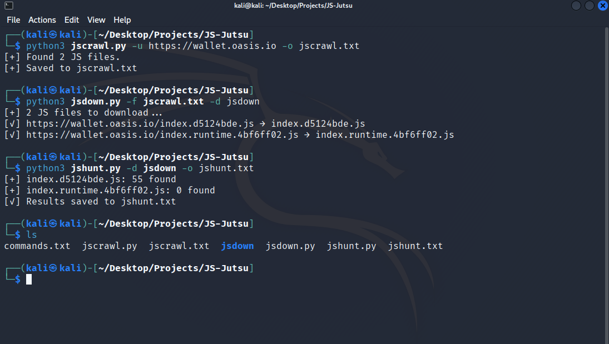

# JS-Jutsu
JS-Jutsu finds, downloads and examines .js endpoints on the target site.

### 6. Installation of requirements.txt
```bash
pip3 install -r requirements.txt
```
### Usage of JS-Jutsu

#### jscrawl
```bash
python3 jscrawl.py -u https://target.com -o jscrawl.txt
```
Finds and saves the target site's javascript endpoints.

#### jsdown
```bash
python3 jsdown.py -f jscrawl.txt -d jsdown
```
Reads the file containing the found links and downloads the javascript files.

#### jshunt
```bash
python3 jshunt.py -d jsdown -o jshunt.txt
```
Examines downloaded javascript files and saves important informations to a txt file.

### Example Usage


